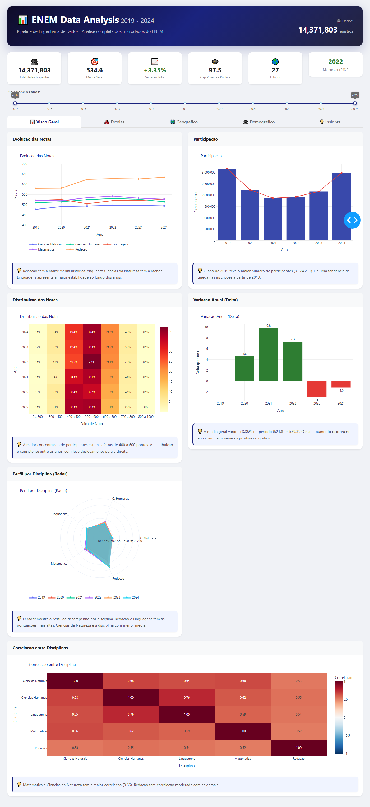
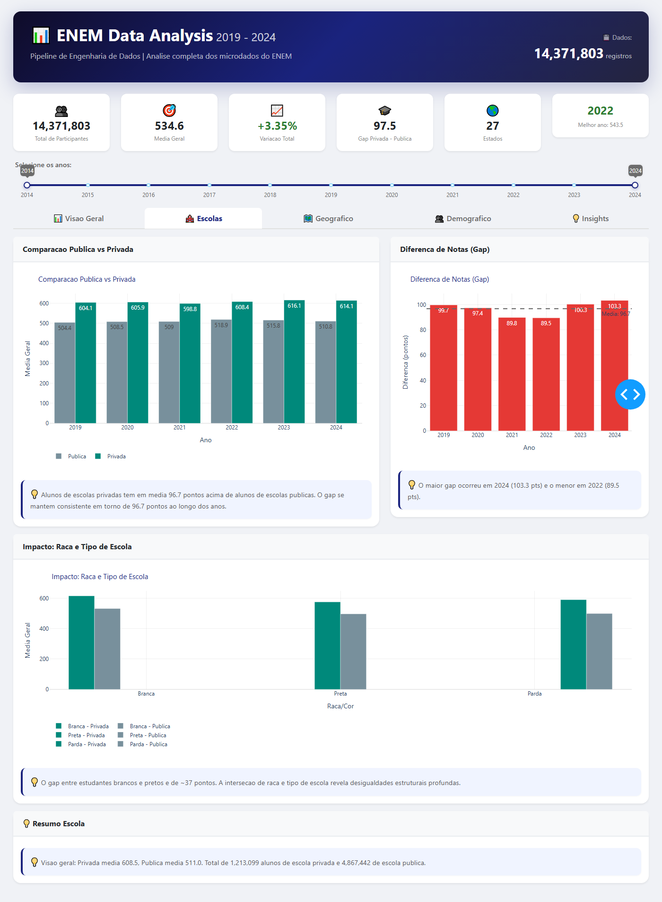
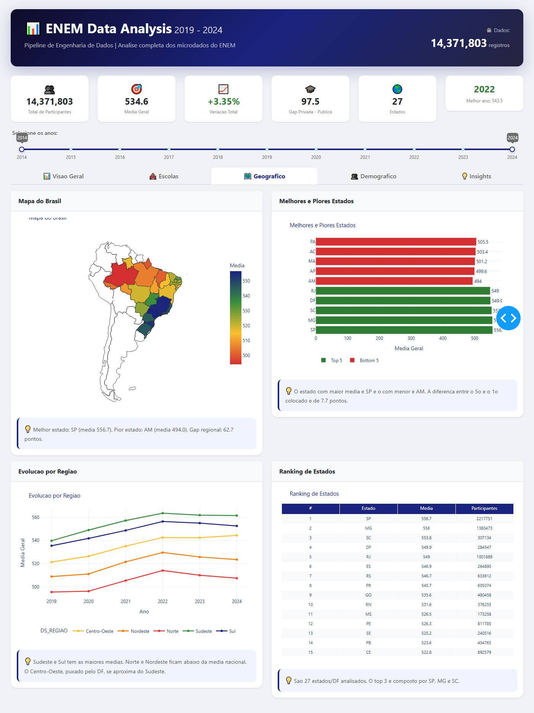
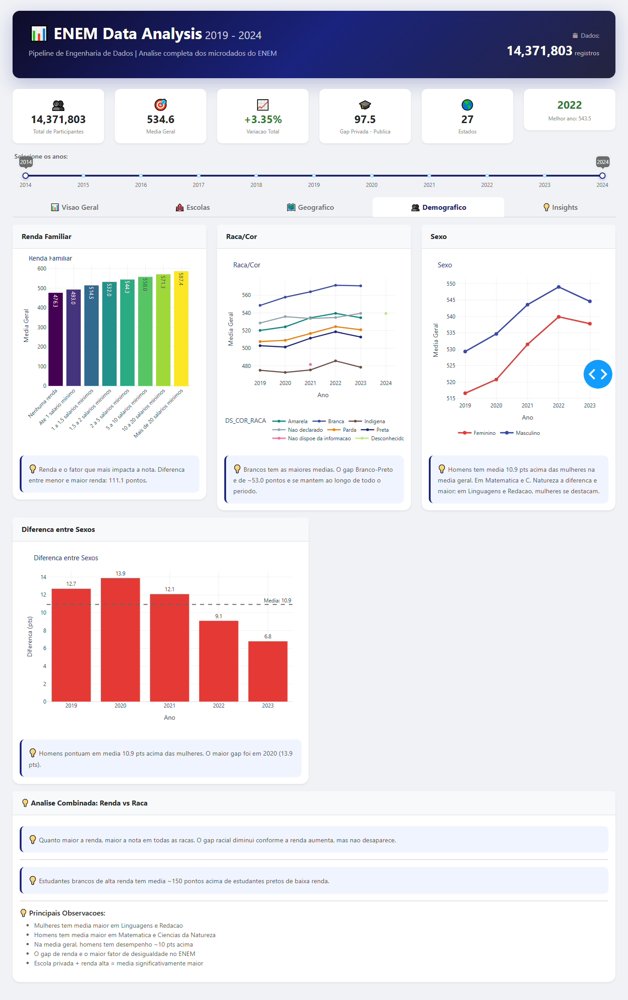
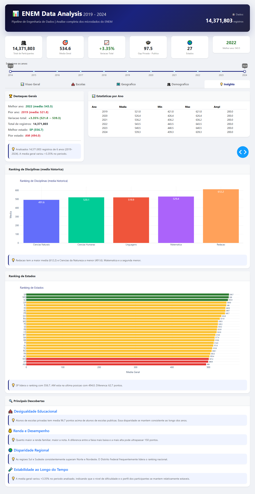

# ENEM Data Analysis Dashboard

Pipeline de engenharia de dados e dashboard interativo para analise dos microdados do ENEM (2019-2024), processando **14.4 milhoes de registros** com visualizacoes sobre desempenho, desigualdade educacional e tendencias.

## Funcionalidades

- Processamento completo de 6 anos de microdados do INEP (37.5M brutos -> 14.4M filtrados, 2019-2024)
- Tabelas pre-computadas para consultas instantaneas (< 1s)
- Dashboard interativo com 5 abas de analise
- Insights automaticos sobre: desempenho por disciplina, gap escola publica vs privada, disparidades regionais, impacto de renda e raca

## Tecnologias

| Ferramenta | Uso |
|---|---|
| **Python** | Pipeline de ETL e backend do dashboard |
| **Pandas / NumPy** | Processamento e transformacao dos dados |
| **SQLite** | Armazenamento local com agregacoes pre-computadas |
| **Dash / Plotly** | Dashboard interativo com graficos dinamicos |
| **Dash Bootstrap Components** | Interface responsiva com cards e abas |
| **Playwright** | Automacao de screenshots para documentacao |

## Dashboard

### Visao Geral


### Escolas


### Geografico


### Demografico


### Insights


## Instalacao

```bash
# Clone o repositorio
git clone https://github.com/TayschreN/enem-dashboard.git
cd enem-dashboard

# Instale as dependencias
pip install -r requirements.txt
```

## Como usar

### 1. Pipeline completo (download + extracao + transformacao + carga)

> **Nota:** O banco de dados completo (~2.5 GB baixados, ~800 MB processados) esta incluido no `.gitignore`. Para obter os dados, execute o pipeline:

```bash
python pipeline.py
```

Este script executa todo o fluxo:
- **download.py** - Baixa os microdados do site do INEP
- **extract.py** - Extrai os arquivos ZIP
- **load.py** - Carrega os dados brutos no SQLite
- **precompute.py** - Gera as tabelas agregadas para consultas rapidas

### 2. Dashboard

```bash
python app.py
```

Acesse em http://127.0.0.1:8051

### 3. Modulos individuais

```bash
python download.py        # Download dos microdados
python extract.py         # Extracao dos ZIPs
python transform.py       # Limpeza e filtragem
python load.py            # Carga no SQLite
python precompute.py      # Pre-computacao das agregacoes
python queries.py         # Teste das consultas
```

## Estrutura do projeto

```
enem-dashboard/
├── app.py              # Dashboard Dash interativo
├── config.py           # Configuracoes (caminhos, mapeamentos)
├── pipeline.py         # Pipeline ETL completo
├── download.py         # Download dos microdados do INEP
├── extract.py          # Extracao dos arquivos ZIP
├── load.py             # Carga no banco SQLite
├── precompute.py       # Pre-computacao de agregacoes
├── process_2024.py     # Tratamento especial para formato 2024
├── queries.py          # Funcoes de consulta ao banco
├── transform.py        # Limpeza e transformacao dos dados
├── run_real_pipeline.py# Script de execucao do pipeline
├── test_pipeline.py    # Testes unitarios
├── requirements.txt    # Dependencias
├── screenshots/        # Screenshots do dashboard
└── data/
    └── enem.db         # Banco SQLite (gitignored)
```

## Dados

### Processamento

| Etapa | Registros |
|---|---|
| Brutos (2014-2024) | ~37.5 milhoes |
| Apos filtragem (2019-2024) | ~14.4 milhoes |
| Tabelas agregadas | 11 visoes pre-computadas |

### Filtros aplicados
- Exclusao de treineiros (`IN_TREINEIRO != 1`)
- Presenca confirmada em todas as 4 provas objetivas (`TP_PRESENCA = 1`)
- Notas nao nulas em todas as disciplinas
- Remocao dos anos 2014-2018 (apenas 2019-2024 processados)

### Precisao dos dados

Comparacao com medias oficiais do INEP (2023):

| Disciplina | INEP | Nosso | Diferenca |
|---|---|---|---|
| Ciencias da Natureza | 497.4 | 497.0 | -0.4 |
| Ciencias Humanas | 522.0 | 527.0 | +5.0 |
| Linguagens | 516.2 | 520.5 | +4.3 |
| Matematica | 534.9 | 532.2 | -2.7 |
| Redacao | 641.6 | 625.8 | -15.8 |

As pequenas diferencas sao esperadas devido aos filtros de treineiros e exigencia de presenca em todas as provas.

## Insights principais

- **Desigualdade educacional:** Alunos de escolas privadas tem ~57 pontos acima de alunos de escolas publicas
- **Impacto da renda:** Diferenca de ~111 pontos entre a faixa de maior e menor renda
- **Disparidade regional:** Sudeste e Sul tem medias ~40-50 pontos acima de Norte e Nordeste
- **Genero:** Homens tem ~10 pontos acima na media geral; mulheres se destacam em Linguagens e Redacao
- **Estabilidade:** A variacao da media geral no periodo e inferior a 5%

## Licenca

MIT
